<div align='center'>

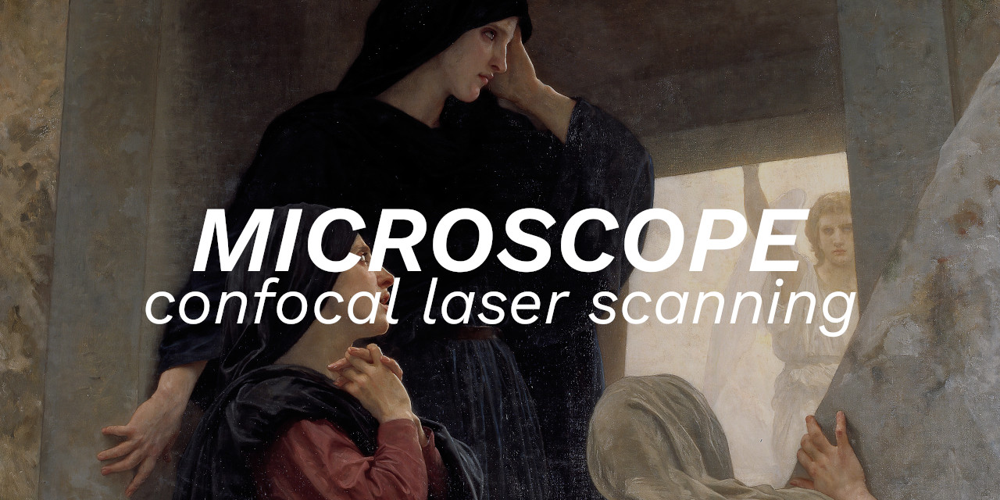

</div>

<br>

Primeiramente gostaria de dizer que fiz este projeto por pura diversão. A ideia dele é simplesmente capturar uma imagem de alguma coisa em escala microscópica, e olhar pra ela com um belo sorriso no rosto.

Como amostra utilizei uma lâmina de silício com a litrografia de um microchip exposta. Onde foram capturadas imagens mostrando os pontos de contato do microchip.

<br>

<table width="100%">
  <tr>
    <td valign="top" width="33%" >
       <b>IMAGE 1</b>
       
    </td>
    <td valign="top" width="33%" >
       <b>IMAGE 2</b>
       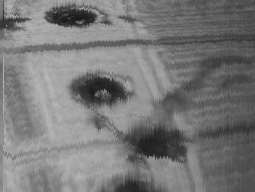
    </td>
    <td valign="top" width="33%" >
       <b>IMAGE 3</b>
       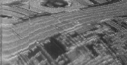
    </td>
  </tr>
</table>

<table width="100%">
  <tr>
    <td>
       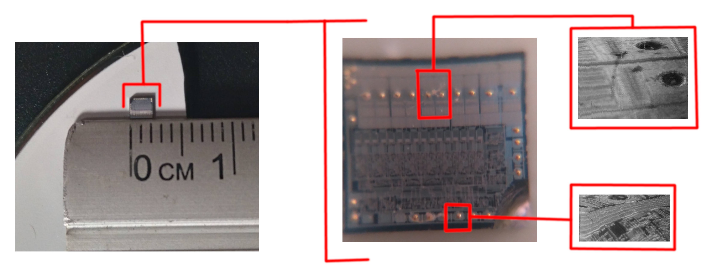
    </td>
  </tr>
</table>

<br>

Tendo em vista que em um espaço de 2mm cabem mais ou menos 10 pontos de contato (como mostra na imagem acima). Convertendo de milímetros para micrômetros, temos então 2000 micrômetros. Dividindo 2000 micrômetros por 10, temos o valor de 200 micrômetros por ponto de contato. Podemos então dizer que a <b>imagem 1</b> capturada possui mais ou menos <b>200 micrômetros</b>.

<br>

O truque aqui é compreender o conceito de CLSM e entender que as coisas refletem luz, e que podemos capturar essa luz e com ela montar uma imagem em grayscale.

<br>
<b>Vamos para o experimento...</b>

<br>
<br>

# O Conceito

Para conseguir realizar essa brincadeirinha divertida vamos ter que reproduzir o conceito de <b>(CLSM) Confocal Laser Scanning Microscope</b>. Portanto, para esclarecer as coisas, vamos ter em mente do que se trata este conceito.

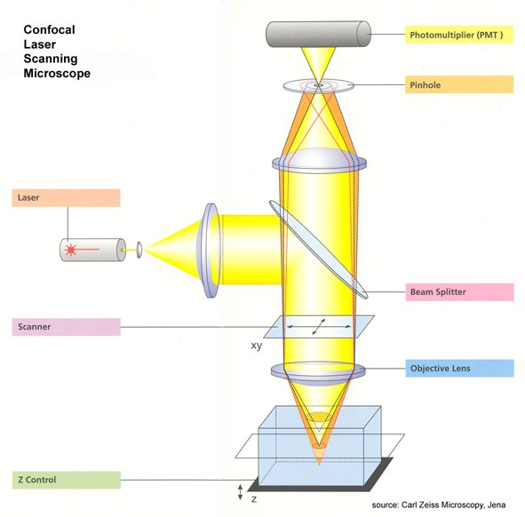

<br>


<table width="100%">
  <tr>
    <td valign="top" width="30%" >
       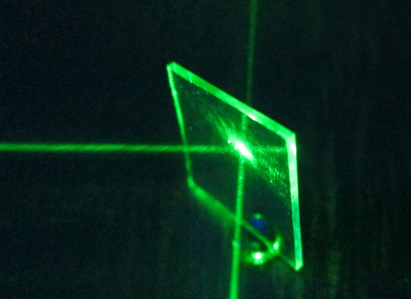
    </td>
    <td valign="top" width="70%" >
        Tudo começa no laser, ele emite um feixe de luz que se choca com o chamado <b>Beam Splitter</b>, que é apenas um vidro transparente. Veja na imagem ao lado o que acontece quando uma luz de um laser se choca com um vidro.
        <br><br>
        Como é um vidro transparente, parte da luz simplesmente atravessa o vidro, mas outra parte é refletida, pois o vidro, mesmo transparente, também funciona em parte como um espelho.
    </td>
  </tr>
</table>

<br>

<table width="100%">
  <tr>
    <td valign="top" width="30%" >
       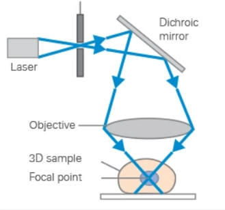
    </td>
    <td valign="top" width="70%" >
        Esta luz que saiu do laser e foi refletida pelo <i>Beam Splitter</i> seguirá indo na direção da <b>Objective Lens</b>, que é nossa lente objetiva, utilizada para focar o feixe da luz do laser num único ponto. 
        <br><br>
        Logo abaixo de nossa lente objetiva, estará nossa <b>amostra</b>, ou seja, o material que queremos capturar uma imagem microscópica. Portanto, é importante que o laser esteja devidamente focalizado na amostra para que o dispositivo possa funcionar.
        <br><br>
        Isto que acabamos de descrever se resume na imagem ao lado. Observe o caminho que a luz faz, simbolizado pelas setas em azul.
    </td>
  </tr>
</table>

<br>

<table width="100%">
  <tr>
    <td valign="top" width="30%" >
       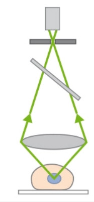
    </td>
    <td valign="top" width="70%" >
        Agora observe nesta imagem ao lado. Ela nos mostra o que acontece após a luz do laser bater sobre nossa amostra.
        <br><br>
        A luz é refletida novamente para cima, atravessando novamente a lente objetiva, depois atravessando também nosso Beam Splitter, até atingir um sensor.
        <br><br>
        Importante também observar que antes da luz atingir o sensor (que no caso é um sensor de luminosidade), ela primeiro atravessa o chamado <b>Pinhole</b>, que trata-se de um obstáculo para passar pouca luz (isto ajuda a remover ruídos).
    </td>
  </tr>
</table>

<br>

Portanto, resumindo tudo, a luz que sai de nosso laser é refletida pelo Beam Splitter, depois atravessa nossa lente objetiva responsável por realizar o foco em nossa amostra. Após a luz incidir sobre nossa amostra, a mesma é refletida para cima, atravessando nossa lente objetiva e atingindo novamente nosso Beam Spliter, mas agora fazendo o caminho inverso. Se tratando nosso Beam Splitter de um simples vidro transparente, parte da luz irá atravessá-lo, passando posteriormente por nosso obstáculo (Pinhole) e atingindo nosso sensor de luminosidade.

Desta maneira, utilizando algo como um sensor LDR convencional, teremos no máximo um ponto focalizado em nossa amostra, mas o que queremos é uma imagem. Logo, temos que ter algum mecanismo que nos permita realizar uma varredura nos eixos X,Y. Sendo este o nosso tão querido <b>Scanner</b>.

Desta maneira é possível realizar a varreruda nos eixos X,Y de alguma amostra, e a cada ponto focalizado do laser, capturamos a intensidade luminosa com um sensor de luminosidade. Vamos então armazenando esses valores em algum software, para posteriormente gerar uma imagem com base nesses dados.

Estando claro o conceito descrito acima, vamos para a parte prática :star_struck:

<br>

<div align="center">


</div>

<br>

# Materiais

A primeira coisa que vamos precisar fazer é ir em algum site e comprar um Arduíno e alguns componentes básicos, como resistores, capacitores, jumpers e coisas do tipo. Depois vamos precisar ir em algum ferro-velho e procurar alguns drivers de DVD. Segue abaixo a lista dos materiais.

Importante deixar claro que para construir este projeto, é necessário algumas noções básicas de eletrônica e programação.

<br>

<b>Materiais comprados em lojas online:</b>

- Uma protoboard e jumpers
- Arduino UNO
- Capacitores de 10k uf
- Resistores 330 ohms, 1k ohms, 10k ohms
- Sensor de luz LDR
- Transistores MOSFET (NPN)
- Um laser <b>potente</b>

<br>

<b>Materiais comprados no ferro-velho:</b>

- Drivers de DVD (eu usei 4, mas 2 servem)

<br>

Claro, coisas como cola-quente, papelão e isopor podem ajudar muito. Também é importante deixar claro que para este projeto é necessário um bom laser, o que utilizei eu comprei no Mercado Livre, e é este da imagem abaixo.

<div align="center">

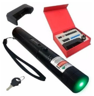

</div>

<br>

# O Scanner

Sendo talvez a nossa parte mais importante do projeto, precisamos do scanner para realizar a varredura dos eixos X e Y. E isso nós faremos com as bobinas de foco das lentes dos próprios drivers de DVD.

<br>

<table width="100%">
  <tr>
    <td valign="top" width="30%" >
       
    </td>
    <td valign="top" width="70%" >
        Note que pegamos um pedaço de fio um pouco rígido e colamos a ponta dele no local onde fica a lente de foco do leitor de DVD. Isso nos permitirá, ao controlar a bobina responsável pelo foco da lente, realizar o movimento para frente e para trás.
        <br><br>
        Este será nosso eixo Y.
    </td>
  </tr>
</table>

<table width="100%">
  <tr>
    <td valign="top" width="30%" >
       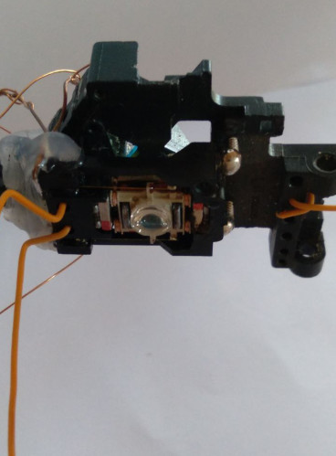
    </td>
    <td valign="top" width="70%" >
        Utilizando a mesma noção acima, mas agora controlando a bobina que realiza o movimento para as laterais, vamos ter nosso eixo X. 
    </td>
  </tr>
</table>

<br>

Em seguida vamos precisar criar algumas perninhas para sustentar nosso dispositivo, ficando como nas imagens abaixo.

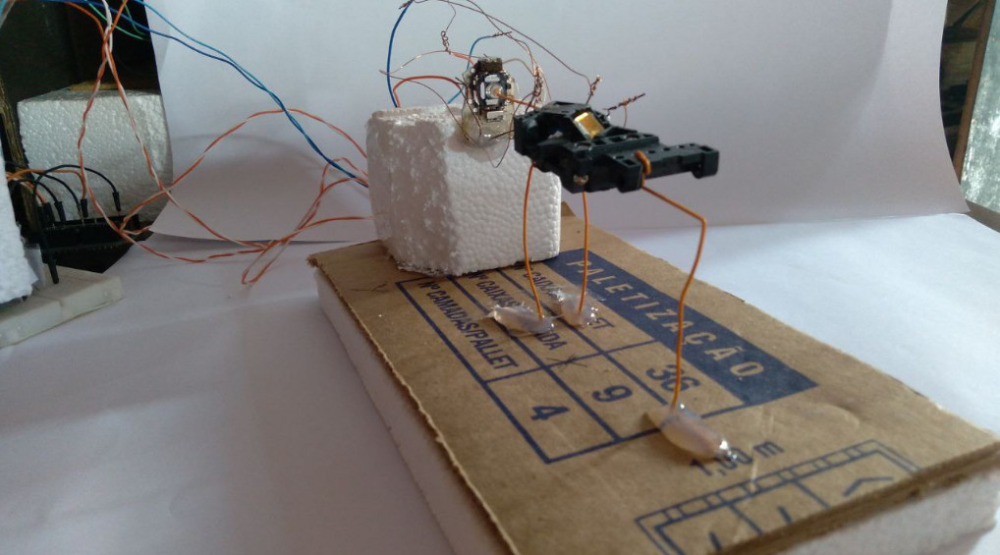
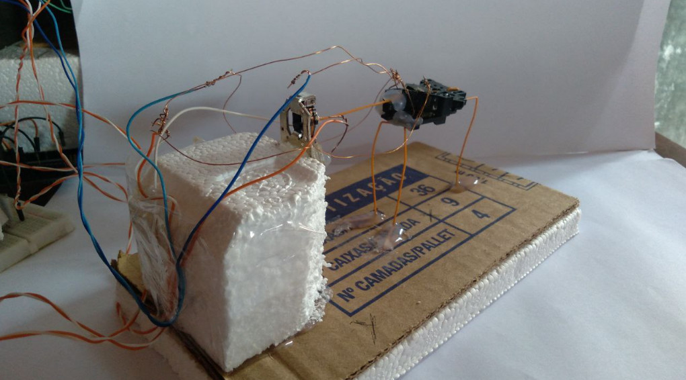

<br>

Note que os fios utilizados nas perninhas são na verdade fios de cabo de rede (os famosos RJ45). Desta maneira é possível movimentar toda nossa "mesinha" (sim, vamos chamar ela de mesinha daqui pra frente) com o controlador do eixo Y. Tendo assim o controle dos eixos X e Y.

Além desta ideia utilizando as bobinas dos driver de DVD, também é possível utilizar alto-falante para controlar os respectivos eixos X e Y.

Em todo caso o que necessitamos é realizar uma varredura nos citados eixos.

<br>

# Controle do eixo Z

Para que consigamos focar a luz do laser devidamente sobre nossa amostra é necessário termos controle do eixo Z, para regulá-lo corretamente, de modo que após estar focado, comecemos nossa varredura.

<table width="100%">
  <tr>
    <td valign="top" width="40%" >
       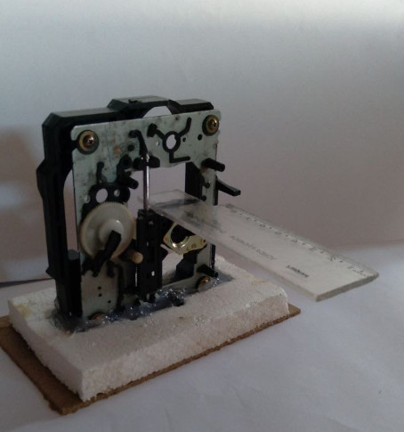
    </td>
    <td valign="top" width="60%" >
        Como você pode ver na imagem ao lado, utilizei a própria peça do driver para ser o controlador. Colei um pedaço de régua nele, onde na ponta desta régua irá ficar minha amostra.
        <br><br>
        O que faço é girar vagarosamente aquela engrenagem lateral, para fazer a amostra subir e descer, e assim ter um bom controle do eixo Z.
    </td>
  </tr>
</table>

<br>

# O Sensor LDR

<table width="100%">
  <tr>
    <td valign="top" width="40%" >
       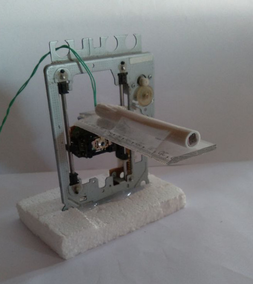
    </td>
    <td valign="top" width="60%" >
        De modo semelhante ao controle do eixo Z, também fiz um para ajustar devidamente meu sensor LDR. Lembrando que aqui é muito melhor utilizar um suporte de "Lupa multifunção de mesa", mas como eu estava sem, fiz desta maneira.
    </td>
  </tr>
</table>

<br>

# O Pinhole

<table width="100%">
  <tr>
    <td valign="top" width="40%" >
       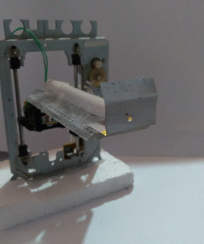
    </td>
    <td valign="top" width="60%" >
        Nesse caso eu utilizei um pedaço de latinha de refrigerante/cerveja, mas você pode utilizar um papel alumínio se preferir.
    </td>
  </tr>
</table>

<br>

# O anteparo

<table width="100%">
  <tr>
    <td valign="top" width="40%" >
       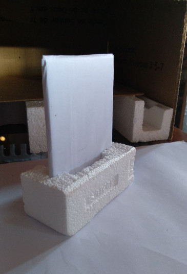
    </td>
    <td valign="top" width="60%" >
        Você pode utilizar o que quiser, ele nos será util para ajustar o foco (que veremos mais adiante).
    </td>
  </tr>
</table>

<br>

# Juntando tudo

Pegando tudo dito acima e juntando em uma caixa, fica mais ou menos como nessa imagem abaixo.

<br>

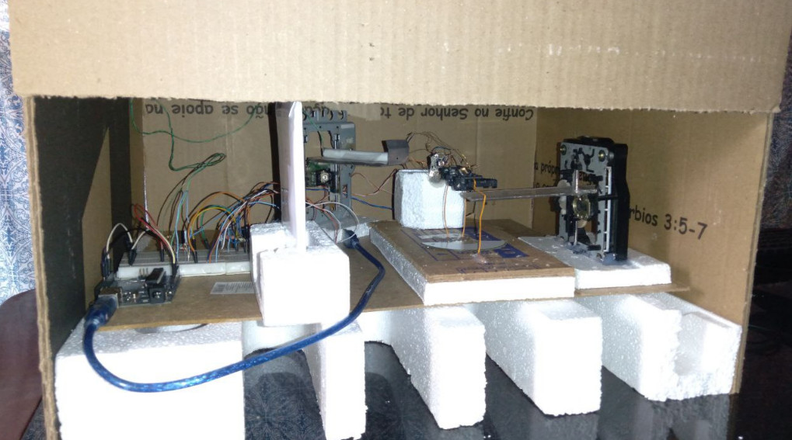
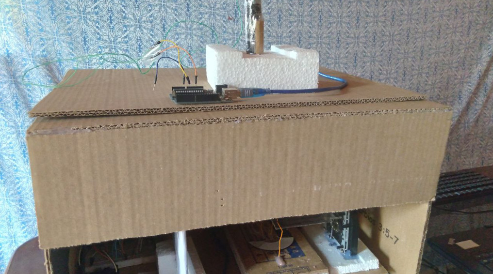

<br>

Note que nessa segunda imagem, fiz um suporte para o laser incidir de cima para baixo, onde ele atingirá a peça de DVD da nossa "mesinha". Tendo isto em mente, você já deve ter percebido que o projeto está com uma diferença. No caso a única diferença em relação ao conceito do CLSM abordado anteriormente, é que trocamos os lugares do laser e do sensor. Ficando nosso laser incidindo de cima pra baixo, e nosso sensor capturando a luz refletida pela lateral.

Note também que para controlar o laser fiz uma ligação direta (cuidado para não queimar seu laser, verifique os limites dele). Onde usei um segundo Arduino só para servir de Power Supply.

<br>

# O controle do dispositivo

Antes de tudo tenhamos em mente que estamos controlando exatamente estas coisas:

- A bobina do eixo Y
- A bobina do eixo X
- O sinal lido pelo sensor LDR

É bem sabido que para variar um sinal no Arduino basta fazer uso da função <b>analogWrite</b>, e utilizar algum pino para enviar o sinal. Logo, tudo que precisamos é de um simples circuito eletrônico para realizar amplificação de sinal, coisa que fazemos com o uso de transistores, resistores e capacitores (existem muitos tutoriais na internet a respeito disso). Tendo isto em mente, tudo que você precisa fazer é criar um circuito que controle (e varie) o sinal enviado para suas bobinas, para assim fazê-las movimentar.

No Arduino teremos o seguinte código (<a href="source/arduino.c">arduino.c</a>):

```c
#define PIN_X    9
#define PIN_Y    3
#define PIN_LDR  A0

void setup()
{
  pinMode(PIN_X, OUTPUT);
  pinMode(PIN_Y, OUTPUT);
  pinMode(PIN_LDR, INPUT);

  Serial.begin(115200);
  delay(100);
  Serial.println("Jesus Amor");
}

int delayTime = 23;
int limit     = 256;
int increment = 1;

void loop()
{
  if (Serial.available() > 0)
  {
    String command = Serial.readStringUntil('\n');
    command.trim();
    char receivedChars[256];
    memset(receivedChars, '\0', 256);
    command.toCharArray(receivedChars, 256);

    // Read line.
    if (strstr(receivedChars, "read:"))
    {
      char *ptr = &receivedChars[ strlen("read:") ];
      char currentYCh[256];
      int currentY = 0;

      memset(currentYCh, '\0', 256);

      for (int a=0; ptr[a]!='\0' && ptr[a]!='\n'; a++)
      {
        if (ptr[a] == '-')
        {
          currentY = atoi(currentYCh);
          break;
        }
        
        currentYCh[a] = ptr[a];
      }

      // Control: X, Y.
      Serial.print("startline");
      analogWrite(PIN_Y, currentY);
      delay(50);
      
      for (int x=0; x<limit; x+=increment)
      {
        analogWrite(PIN_X, x);
        delay(delayTime);
        
        int LDR = analogRead(PIN_LDR) / 4;
        Serial.print(LDR, DEC);
        Serial.print(",");
      }
      
      Serial.print("endline");
      delay(100);
    }
  }
}
```

Tenha em mente que o código acima recebe uma entrada de dados pelo cabo USB, no caso o texto "<b>read:Y-</b>", onde o valor de Y equivale a linha que está sendo processada. Em seguida o mesmo faz a bobina movimentar-se para a devida posição, para em seguida começar a leitura. Ou seja, a bobina do eixo X irá movimentar-se de 0 a 256, onde a cada incremento é realizada a leitura do sensor de luminosidade. Tudo é enviado para o programa que está recebendo estes dados.

No computador executamos o programa [read-data.php](source/read-data.php), onde o papel dele é simplesmente realizar essa comunicaçao com o Arduino, iniciar e controlar a leitura, armazenar os dados localmente para com eles gerar uma imagem em grayscale.

<br>

# Esclarecendo alguns pontos

<table width="100%">
  <tr>
    <td valign="top" width="30%" >
       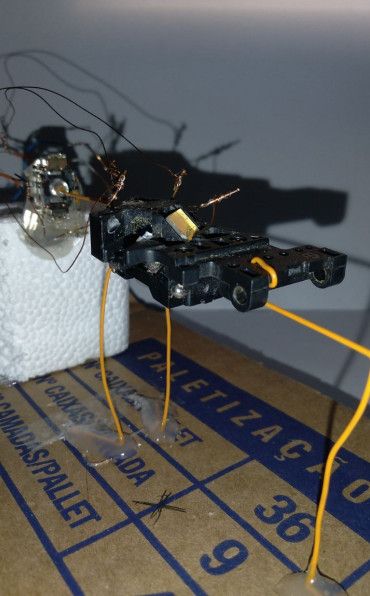
    </td>
    <td valign="top" width="60%" >
        Importante mencionar que nossa peça do driver de DVD faz o papel do Beam Splitter. Ou seja, o mecanismo do driver de DVD já tem quase tudo pronto para usarmos, basta alguns ajustes para com ele termos nosso microscópio.
    </td>
  </tr>
</table>

<br>

Na imagem abaixo você pode ver um protótipo operando. Observe que a luz do quarto está desligada, pois como todo o dispositivo está exposto, não é legal que exista interferência luminosa.

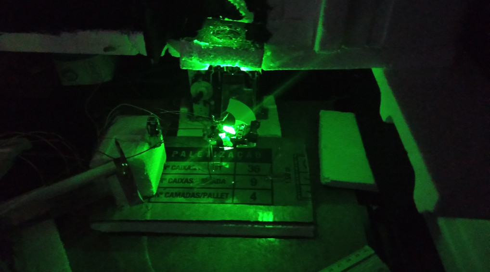

<br>

# Amostra

Para utilizar como amostra eu dei um jeito de retirar uma lâmina de silício de dentro de um microchip convencional (isso deu trabalho). Dê uma olhada nas imagens abaixo.

Utilizando lentes ópticas eu consegui um zoom grande para uma fotografia optica deles para eu ver como são.

<table width="100%">
  <tr>
    <td valign="top" width="30%" >
       <b>ITEM 1</b>
       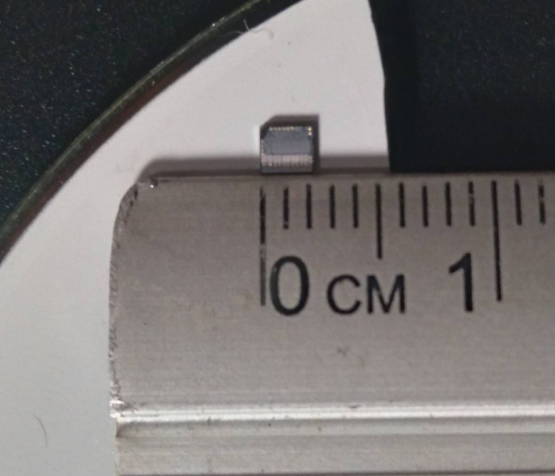
    </td>
    <td valign="top" width="45%" >
       <b>ITEM 2</b>
       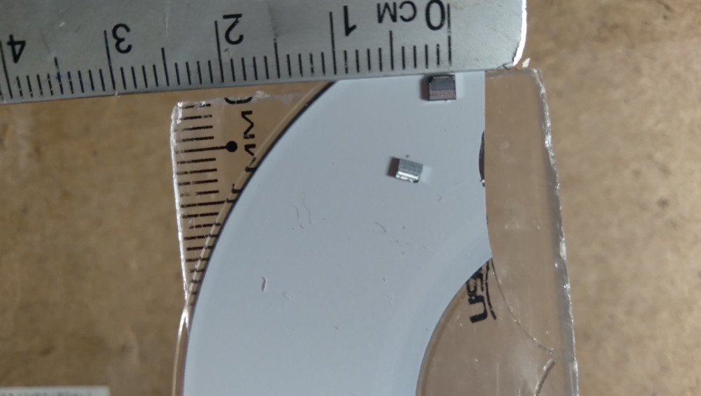
    </td>
    <td valign="top" width="25%" >
       <b>ITEM 3</b>
       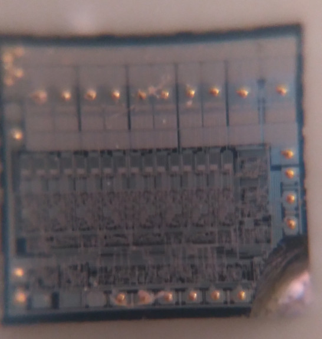
    </td>
  </tr>
</table>

Os itens 1 e 2 são apenas para dar uma noção de proporção e tamanho. 

O item 3 é a fotografia óptica que consegui (para ela usei uma lente também de driver de DVD, mas acoplada na câmera do celular). O bom de termos uma fotografia óptica é para confirmar se nossa imagem gerada pelo dispositivo está correta.

<br>

# Complicações e ajustes

<table width="100%">
  <tr>
    <td valign="top" width="30%" >
       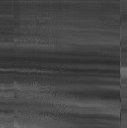
    </td>
    <td valign="top" width="60%" >
        O erro mais comum de quem tenta reproduzir este experimento é não conseguir ajustar o foco devidamente, quando isso ocorre sua imagem de saída ficará semelhante a esta. Ou seja, um lixo.
    </td>
  </tr>
</table>

<table width="100%">
  <tr>
    <td valign="top" width="30%" >
       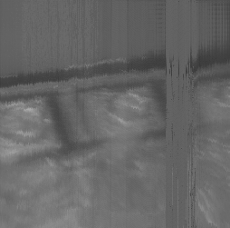
    </td>
    <td valign="top" width="60%" >
        Quando você começa a conseguir corrigir o foco, já começa aparecer algumas formas legais, como esta, onde já começa a aparecer alguns terminais de contato do microchip.
    </td>
  </tr>
</table>

<br>

Em resumo, você deve ir ajustando seu dispositivo para ficar o melhor possível, pois qualquer coisinha torta, ruído nas leituras, interferências luminosas, travamentos das peças (caso os driver de DVD forem velhos demais), tremores (um carro passando lá na esquina da sua casa irá afetar os seus resultados), e coisas semelhantes afetam em seu resultado final.

<br>

# Resultados

Observe que na parte de cima das imagens geradas há sempre uma distorção, pelo que entendi isso se deve ao meu mecanismo estar meio duro no começo da leitura. Depois ele fica normal e segue até o fim. Como eu disse, qualquer coisinha torta já afeta no seu resultado. No entanto já começam a aparecer imagens legais.

<table width="100%">
  <tr>
    <td valign="top" width="33%" >
       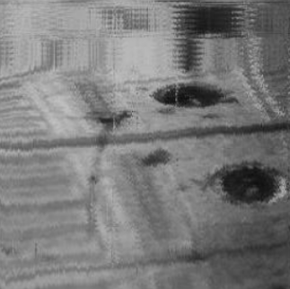
    </td>
    <td valign="top" width="33%" >
       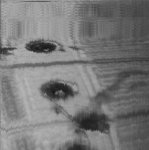
    </td>
    <td valign="top" width="33%" >
       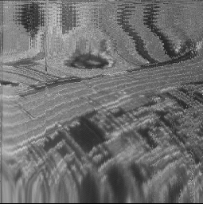
    </td>
  </tr>
</table>

<br>

Retirando a parte distorcida de nossa leitura, as imagens ficam assim:

<table width="100%">
  <tr>
    <td valign="top" width="33%" >
       
    </td>
    <td valign="top" width="33%" >
       
    </td>
    <td valign="top" width="33%" >
       
    </td>
  </tr>
</table>

<br>

Colocando nossa lâmina de silício ao lado das nossas imagens, conseguimos ter melhor uma noção de proporção. Se fosse encontrar um número para nos dar uma aproximação satisfatória do tamanho da imagem que conseguimos capturar, chegaremos ao valor de mais ou menos 200 micrômetros.

<table width="100%">
  <tr>
    <td>
       
    </td>
  </tr>
</table>

<br>

# Finalização

Como você pode notar, tudo isso é apenas uma diversão. Logo, é claro que há pontos e coisas que podem ser melhoradas (sempre há). Em todo caso, espero que tenha gostado 😀

Fique com Jesus e nossa Senhora Maria Santíssima :purple_heart:

<br>

# Links e Referências

http://www.gaudi.ch/GaudiLabs/?page_id=652

https://www.instructables.com/Laser-Scanning-Microscope/

https://www.instructables.com/Scanning-Laser-Microscope-With-Arduino/

https://bitesizebio.com/19958/what-is-confocal-laser-scanning-microscopy/

https://ibidi.com/content/216-confocal-microscopy


